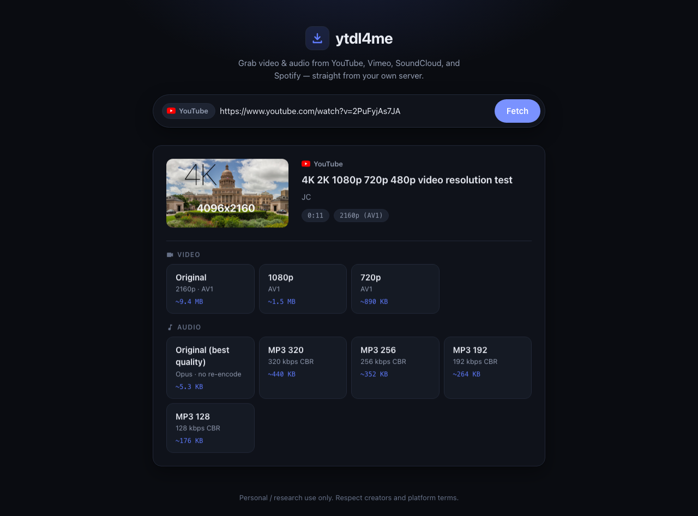

# ytdl4me

Self-hosted web app for downloading media from **YouTube, Vimeo, SoundCloud, Spotify, Deezer, JOOX, TIDAL, Apple Music, and Beatport** — including **playlists/albums as ZIP** — built as a study of modern media pipelines: stream selection, lossless remuxing, and metadata handling. One Docker container: FastAPI + [yt-dlp](https://github.com/yt-dlp/yt-dlp) + ffmpeg behind a clean, no-build-step web UI.

**Agents / multi-tool workflows:** start at [`AGENTS.md`](AGENTS.md) (portable runbook index).

> [!WARNING]
> **FOR RESEARCH AND EDUCATIONAL PURPOSES ONLY.**
> This tool must **not** be used to download copyrighted content or any content you do not own or have explicit permission to save. You are solely responsible for how you use it. Read the [full disclaimer](#disclaimer--acceptable-use) before running it.



## Disclaimer & acceptable use

This project exists **solely for research and educational purposes**: studying how media platforms deliver streams, and how stream selection, remuxing, transcoding, and metadata pipelines work. It is not designed, intended, or endorsed for infringing anyone's rights, and it is provided **as-is, without warranty of any kind**.

**✅ You may use it only with:**

- content **you created and own**;
- content whose rights holder has given you **explicit permission** to download;
- **public-domain** media, or media under an **open license** (e.g. Creative Commons) that permits downloading;
- your own uploads that you're backing up from your own accounts.

**🚫 You may not use it to:**

- download, copy, or archive **copyrighted content without authorization** from the rights holder;
- **redistribute, re-upload, sell, or monetize** anything you download;
- bypass **paywalls, subscriber-only content, purchases, or DRM** (the tool does not do this, and no support will be given for attempting it);
- perform **bulk scraping or mass downloading** of any platform.

**Platform terms.** The terms of service of YouTube, Vimeo, SoundCloud, and Spotify generally prohibit unauthorized downloading — in many cases *even for content that is freely licensed*. Using this tool against those platforms may breach their terms regardless of copyright status. Reviewing and complying with the applicable terms is **your responsibility**.

**Spotify.** This tool does not touch Spotify's DRM-protected streams. It reads a track's *public metadata* (artist, title, artwork) and downloads the closest matching audio from YouTube — the same approach as spotDL. Everything above about copyright and platform terms applies to that YouTube download.

**Jurisdiction.** Copyright and private-copying law varies by country. What is lawful in one jurisdiction may be infringement in another. Know your local law before using this tool.

**No liability.** The authors and contributors accept **no responsibility or liability** for what you do with this software, for any content you download, or for any consequences of its use — including account suspensions, ToS enforcement, or legal claims. Misuse is entirely at your own risk.

**When in doubt, don't download it.** If you cannot clearly point to why you have the right to save a file, assume you don't.

## Features

- **Quality tiers without quality loss.** Original / 1080p / 720p are produced by *selecting source streams*, never by re-encoding. ffmpeg only merges and remuxes with stream copy — the video bits are exactly what the platform served. Smaller tiers stay small because yt-dlp prefers efficient codecs (VP9/AV1) at each resolution.
- **Honest "best" audio.** "Original (best quality)" is a bit-exact copy of the source audio stream in its native container (Opus or M4A). The sources are already lossy, so we deliberately don't offer FLAC/WAV — it would triple the file size and add zero quality.
- **MP3 tiers.** 320 / 256 / 192 / 128 kbps CBR via LAME, with metadata and cover art embedded — for players that need MP3.
- **Fast SoundCloud downloads (including DRM tracks).** Progressive HTTP is preferred when available; otherwise segments are fetched concurrently. Label/Go tracks that only offer Widevine `ctr-encrypted-hls` are unlocked via a short license step + CENC decrypt (same class of pipeline as online SC converters), so a ~4-minute track typically finishes in a few seconds at full quality instead of failing or crawling at realtime.
- **No paid account required for Deezer / TIDAL / Apple Music / Spotify / Beatport.** Public metadata is read from each storefront, then we try a **SoundCloud match with progressive/Widevine decrypt** (often clean AAC ~160 kbps at network speed). If no confident SC hit exists, we fall back to a **YouTube match**. Beatport only exposes free LOFI previews without a Streaming plan; full masters use the same SC/YT cascade. Optional native tokens still unlock first-party streams when you set them.
- **Spotify, explained honestly.** Spotify streams are DRM-protected and cannot be ripped directly. Like spotDL, ytdl4me reads the track's *public metadata* (artist, title, artwork), finds the best matching audio on YouTube (or SoundCloud when a confident match exists), and downloads that. Quality depends on the match. Playlists and albums are supported (track list + ZIP); reliable Spotify listing works best with free Web API client credentials (see env table).
- **Playlists & albums.** Paste a YouTube playlist, SoundCloud set, Spotify/Deezer/TIDAL/Apple album or playlist, or Beatport release — pick tracks with checkboxes and download a **ZIP** (or separate files). Same input field as single links.
- **Live progress.** Per-job progress with speed and ETA (including multi-track batch counters); the file auto-downloads in your browser when ready.
- **Unlisted sharing.** Set `ACCESS_KEY` and share a link with the token in its fragment — friends click and go, the bare URL stays gated, and the tool is kept out of search engines and AI crawlers. See [Sharing it (unlisted)](#sharing-it-unlisted).
- **Self-renewing cookies.** With a persistent volume, yt-dlp's rotated YouTube session is written back after every run, so cookies you provide keep renewing themselves instead of going stale. See [`COOKIES_STATE_FILE`](#configuration).
- **YouTube-ready out of the box.** The image bundles [Deno](https://deno.com) + `yt-dlp-ejs` to solve YouTube's JavaScript signature challenge — no extra setup.
- **Hardened for exposure.** Per-IP rate limiting, an active-job cap, SSRF and path-traversal guards, and a constant-time key check.
- **Self-cleaning.** Job files are temporary and deleted after `FILE_TTL_MINUTES` (default 60).

## Quickstart

### Docker Compose (recommended)

```bash
git clone https://github.com/adamdexter/ytdl4me.git
cd ytdl4me
cp .env.example .env          # optional: set ACCESS_KEY etc.
docker compose up -d --build
```

Open <http://localhost:8000>.

### Plain `docker run`

```bash
docker build -t ytdl4me .
docker run -d --name ytdl4me \
  -p 8000:8000 \
  -e ACCESS_KEY=change-me \
  -v ytdl4me-data:/data \
  ytdl4me
```

### Local development (venv)

Requires Python 3.12+, `ffmpeg`, and [Deno](https://deno.com) on your PATH. Deno is the
JavaScript runtime yt-dlp uses (together with the `yt-dlp-ejs` dependency) to solve
YouTube's signature challenge — without it YouTube returns no downloadable formats. The
Docker image installs Deno for you; only local venv runs need it installed manually
(`curl -fsSL https://deno.land/install.sh | sh`).

```bash
python3.12 -m venv .venv
source .venv/bin/activate
pip install -r requirements.txt
uvicorn server.main:app --reload --port 8000
```

## Configuration

All variables are optional. See [.env.example](.env.example).

| Variable | Default | Meaning |
|---|---|---|
| `PORT` | `8000` | Listen port (the Docker image always listens on `8000` internally; remap with `-p`) |
| `ACCESS_KEY` | unset | If set, all `/api/*` routes (except `/api/health`) require it via `X-Access-Key` header or `?key=` query param |
| `DOWNLOAD_DIR` | `<repo>/downloads` (`/data` in Docker) | Working directory for job files; each job gets its own subdirectory |
| `FILE_TTL_MINUTES` | `60` | Completed job files older than this are deleted by a background task |
| `MAX_CONCURRENT_JOBS` | `3` | Simultaneous downloads; extra jobs wait in the queue |
| `MAX_ACTIVE_JOBS` | `MAX_CONCURRENT_JOBS × 4` | Cap on non-terminal jobs before `/api/download` returns 429 (flood guard) |
| `RATE_LIMIT_PER_MINUTE` | `30` | Per-IP sliding-window limit on `/api/probe` and `/api/download`; `0` disables |
| `ALLOW_ANY_SITE` | `false` | If `false`, only the four supported platforms are accepted |
| `SPOTIFY_CLIENT_ID` / `SPOTIFY_CLIENT_SECRET` | unset | Spotify Web API client credentials (Client Credentials flow). Optional for single tracks; **recommended for playlist/album track lists**. Create a free app at developer.spotify.com |
| `MAX_PLAYLIST_TRACKS` | `100` | Cap on tracks returned/downloaded from a playlist, album, or set |
| `COOKIES_FILE` | unset | Path to a Netscape-format `cookies.txt` passed to yt-dlp (see troubleshooting) |
| `COOKIES_B64` | unset | Base64 of a `cookies.txt` — use this instead of `COOKIES_FILE` on hosts where you can't mount a file (Railway, Fly) |
| `COOKIES_CONTENT` | unset | Raw `cookies.txt` contents (alternative to `COOKIES_B64`) |
| `COOKIES_STATE_FILE` | unset | Path on a **persistent volume**. Seeded once from the cookie vars above, then yt-dlp's rotated cookies are written back after every run so the YouTube session self-renews instead of going stale. Needs a real volume (e.g. a Railway volume at `/state`). |
| `WIDEVINE_DEVICE_FILE` | unset | Path to a pywidevine `.wvd` used for SoundCloud / Apple Music DRM. Optional — if unset, a public L3 device is cached on first DRM download. |
| `WIDEVINE_DEVICE_B64` | unset | Base64 of a `.wvd` (alternative to `WIDEVINE_DEVICE_FILE` for hosts that only support env vars). |
| `TIDAL_ACCESS_TOKEN` | unset | Optional TIDAL bearer token for **native** streams. Without it, TIDAL links resolve publicly and download the best **YouTube match** (same approach as Spotify). |
| `TIDAL_REFRESH_TOKEN` | unset | Optional refresh token for native TIDAL. |
| `TIDAL_COUNTRY_CODE` | `US` | TIDAL catalog country (native path). |
| `APPLE_MEDIA_USER_TOKEN` | unset | Optional `media-user-token` for **native** Apple Music AAC. Without it, links use public catalog metadata + **YouTube match**. |
| `JOOX_COOKIE` | guest default | Optional JOOX session cookie override for regional catalogs. |
| `DEEZER_ARL` | unset | Optional Deezer `arl` for **native** full-length streams. Without it, Deezer links use public metadata + SC/YT match. |
| `BEATPORT_USERNAME` / `BEATPORT_PASSWORD` | unset | Optional Beatport Streaming login ([beatportdl](https://github.com/unspok3n/beatportdl)-compatible OAuth) for **native** AAC/FLAC. Without them, Beatport uses public metadata + SC/YT match. |
| `BEATPORT_ACCESS_TOKEN` | unset | Optional raw OAuth bearer (alternative to username/password). |

## Sharing it (unlisted)

The app is an *unlisted* tool, not a public one. Set `ACCESS_KEY` to a long random
string, then share a link with the token in its fragment:

```
https://your-app.example/#key=YOUR_ACCESS_KEY
```

Anyone who opens that link is unlocked automatically (the token is stored in their browser
and stripped from the address bar) — no password prompt. Someone who hits the bare URL
can't do anything. The token lives in the URL **fragment**, so it isn't sent to the server
or written to access logs. The app also ships a `robots.txt`, a `noindex` meta tag, and an
`X-Robots-Tag` header to keep it out of search engines and AI crawlers — but that only
deters well-behaved bots, so treat the link itself as the secret and don't post it
publicly. Rotate `ACCESS_KEY` if a link leaks.

## Deployment

This app needs a real, always-on process with ffmpeg and scratch disk — i.e. a container host or a VPS, not serverless.

### Railway (recommended)

1. Push this repo to GitHub, then in [Railway](https://railway.app) create a **New Project → Deploy from GitHub repo**. Railway auto-detects the Dockerfile and builds it.
2. In the service's **Variables**, add `ACCESS_KEY` (and anything else from the table above). For YouTube/Spotify, add `COOKIES_B64` (see [troubleshooting](#youtube-bot-check-sign-in-to-confirm-youre-not-a-bot)).
3. Under **Settings → Networking**, generate a public domain and set the target port to **8000**.
4. *(Optional but recommended for YouTube)* Add a **Volume** mounted at `/state` and set `COOKIES_STATE_FILE=/state/cookies.txt` so the YouTube session self-renews across restarts. The container runs as root so the volume is writable.

Verify with `GET /api/health` — it reports `auth_required`, `cookies_configured`, and `cookies_renewing`.

### Fly.io

The repo ships a `fly.toml` (edit the app name if `ytdl4me` is taken):

```bash
fly launch --no-deploy      # accepts the existing fly.toml
fly secrets set ACCESS_KEY=change-me
fly deploy
```

Machines auto-stop when idle. `/data` is ephemeral on Fly, which is fine — job files are temporary by design.

### VPS / home server

Any box with Docker:

```bash
git clone https://github.com/adamdexter/ytdl4me.git && cd ytdl4me
cp .env.example .env    # set ACCESS_KEY
docker compose up -d --build
```

Put a reverse proxy with TLS in front if it's internet-facing, e.g. Caddy:

```
media.example.com {
    reverse_proxy localhost:8000
}
```

### Why not Vercel or SiteGround?

- **Vercel** is a serverless platform: functions have short execution limits and small request/response size caps, there is no ffmpeg or persistent yt-dlp runtime, and no writable working disk for multi-hundred-MB jobs. On top of that, YouTube aggressively bot-blocks well-known datacenter IP ranges. A download that streams for minutes and merges gigabytes simply isn't a serverless workload.
- **SiteGround shared hosting** (and shared hosting generally) doesn't allow long-running daemons — you can't keep a uvicorn server or an ffmpeg process alive, and background jobs get killed.

Anything that runs Docker (Railway, Fly.io, Render, a VPS, a Raspberry Pi at home) works.

## Troubleshooting

### YouTube bot check: "Sign in to confirm you're not a bot"

YouTube challenges requests from datacenter IP ranges, which is where almost all cloud hosts (Railway, Fly, Render, VPS providers) live. SoundCloud and Vimeo are unaffected; Spotify is affected because it resolves tracks through a YouTube search. The fix is to give yt-dlp cookies from a logged-in browser session so YouTube treats the server as a signed-in user.

**Export the cookies (do this once):**

1. Use a **throwaway Google account**, not your main one — cookies used from a datacenter IP can get an account rate-limited or flagged.
2. In a **private/incognito window**, sign in to that account and open <https://www.youtube.com>.
3. With a Netscape-format cookie exporter such as the "Get cookies.txt LOCALLY" extension, export cookies for `youtube.com` to a file `cookies.txt`.
4. **Close the private window without navigating further** — YouTube rotates the session cookie on use, which can invalidate an exported file that's still "live".

**Provide the cookies to the server — pick the method that matches your host:**

*Railway / Fly / any host with only environment variables* — base64-encode the file and paste it into a `COOKIES_B64` variable:

```bash
base64 -i cookies.txt | tr -d '\n'      # macOS: copy the output
# base64 -w0 cookies.txt                # Linux equivalent
```

Then set that string as `COOKIES_B64` in the service's variables and redeploy. (Base64 avoids newline/character issues in env-var UIs. Raw contents also work via `COOKIES_CONTENT`.)

*Docker / VPS with a mountable filesystem* — bind-mount the file and point `COOKIES_FILE` at it:

```yaml
# docker-compose.yml, under the service:
    volumes:
      - ./cookies.txt:/data/cookies.txt:ro
    environment:
      - COOKIES_FILE=/data/cookies.txt
```

**Verify it loaded:** `GET /api/health` returns `"cookies_configured": true` once cookies are in place. Cookies expire — if the bot error returns after a few weeks, re-export and update the variable.

### YouTube: "No video formats found" / "n challenge solving failed"

Separate from the bot check: yt-dlp needs a JavaScript runtime to solve YouTube's
signature challenge, or every real format is dropped and you get "No video formats found."
The Docker image ships [Deno](https://deno.com) and the `yt-dlp-ejs` package to handle
this automatically. If you run locally in a venv, install Deno
(`curl -fsSL https://deno.land/install.sh | sh`) so it's on your PATH.

## Legal

See the [Disclaimer & acceptable use](#disclaimer--acceptable-use) section at the top of this README — it is a condition of using this software. **Research and educational purposes only**; never for copyrighted content or content that isn't yours.
